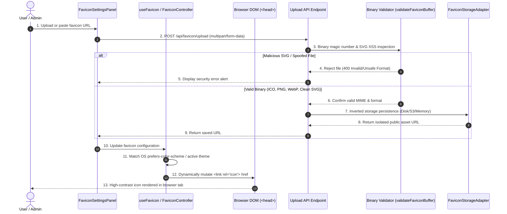

<div align="center">

<a href="https://novexel.co.uk" target="_blank">
  
</a>

# @novexel/favicon_module

### Enterprise-Grade Dynamic Multi-Theme Browser Favicon Controller & Identity Studio

[](LICENSE)
[](https://novexel.co.uk)
[](https://github.com/OWASP/cve-lite-cli)
[](#)
[](#)

[**Novexel Technologies**](https://novexel.co.uk) • London, United Kingdom  
*Engineering secure software solutions, enterprise cloud infrastructure, and cybersecurity services globally.*

---

</div>

## 📌 Executive Summary

**`@novexel/favicon`** is a production-grade, zero-trust browser favicon controller, dynamic tab badge generator, and white-label identity configuration studio.

Engineered by the cybersecurity and software engineering team at **[Novexel](https://novexel.co.uk)**, this package eliminates browser tab contrast degradation and branding mismatches by enabling automated switching between Light Mode and Dark Mode favicons based on system preferences (`prefers-color-scheme`) and in-app themes. It pairs a framework-agnostic core DOM controller with React hooks (`useFavicon`), live browser-tab simulators, and server-side binary magic-byte validators that protect applications against SVG-based Stored Cross-Site Scripting (XSS) and extension spoofing attacks.

> [!IMPORTANT]
> **Open Source & AI-Tool Friendly:** Released under the permissive **MIT License**. It is architected so human developers and AI coding agents can seamlessly inspect, drop in, and customize tab branding across multi-tenant SaaS platforms or standalone enterprise applications.

---

## 🏛️ Security Architecture & Lifecycle Data Flow

The package decouples client-side DOM head manipulation from server-side ingestion and storage via dependency inversion:



---

## 🚀 Key Features

* **Dynamic Theme Auto-Switching**: Automatically adapts tab favicons between Light and Dark mode using browser `matchMedia('(prefers-color-scheme: dark)')` listeners and application theme states.
* **Intelligent Multi-Tier Fallback Ladder**: Resolves icons in order of specificity:
  1. Theme-specific icon (`faviconUrlDark` / `faviconUrlLight`)
  2. Global favicon (`faviconUrl`)
  3. Brand logo fallback (`logoUrlDark` / `logoUrlLight`)
  4. Configurable default (`/favicon.ico`)
* **Real-Time Browser Tab Simulator (`BrowserTabPreview`)**: Realistic light and dark browser Chrome mockup components showing how branding renders on user tab bars.
* **Canvas-Based Dynamic Badging (`createBadgedFavicon`)**: Overlays unread notification counters or status indicators onto favicons as Data URIs without touching disk assets.
* **Binary Magic-Byte File Validation (`validateFaviconBuffer`)**: Deep signature inspection rejecting disguised executable or polyglot files.
* **SVG Stored XSS Mitigation**: Scans and strips embedded `<script>`, `onload`, `javascript:`, or `<foreignObject>` injection vectors from SVG favicons.
* **Pluggable Storage Abstraction (`FaviconStorageAdapter`)**: Reference implementations for In-Memory and Filesystem storage, supporting effortless adaptation to Amazon S3, Azure Blob, or Cloudinary.

---

## 📦 Installation

```bash
npm install @novexel/favicon
```

### Peer Dependencies
```bash
npm install react react-dom
```

---

## 💻 Quickstart

### 1. Client-Side Reactive Favicon Hook (`useFavicon`)

```tsx
import React, { useState } from 'react'
import { useFavicon } from '@novexel/favicon'

export function App() {
  const [theme, setTheme] = useState<'auto' | 'light' | 'dark'>('auto')
  const [unreadNotifications, setUnreadNotifications] = useState(4)

  // Automatically keeps <link rel="icon"> synced to theme and unread counts
  const { currentUrl, effectiveTheme } = useFavicon({
    faviconUrl: '/favicon.ico',
    faviconUrlLight: '/favicons/light.png',
    faviconUrlDark: '/favicons/dark.png',
    theme,
    badge: { count: unreadNotifications, backgroundColor: '#ef4444' },
    title: 'Enterprise Portal',
  })

  return (
    <div>
      <header>Active Tab Icon: {currentUrl} ({effectiveTheme})</header>
    </div>
  )
}
```

### 2. Embedded Identity Settings Studio (`FaviconSettingsPanel`)

```tsx
import React, { useState } from 'react'
import {
  FaviconSettingsPanel,
  type FaviconSettingsConfig,
} from '@novexel/favicon'
import '@novexel/favicon/styles.css'

export function BrandingSettings() {
  const [settings, setSettings] = useState<FaviconSettingsConfig>({
    faviconUrl: '/favicon.ico',
    faviconUrlLight: '/favicon-light.png',
    faviconUrlDark: '/favicon-dark.png',
  })

  return (
    <FaviconSettingsPanel
      settings={settings}
      onChange={setSettings}
      portalTitle="Acme Dashboard"
      onUpload={async (file, field) => {
        const formData = new FormData()
        formData.append('file', file)
        const res = await fetch('/api/upload', { method: 'POST', body: formData })
        const data = await res.json()
        return data.url
      }}
    />
  )
}
```

### 3. Server-Side Magic-Byte & XSS Validation

```typescript
import { validateFaviconBuffer, DiskFaviconStorageAdapter } from '@novexel/favicon/server'

const storage = new DiskFaviconStorageAdapter('./uploads/favicons')

export async function handleUpload(fileBuffer: Buffer, filename: string, tenantId: string) {
  // 1. Verify binary headers and check SVG for script injections
  const validation = validateFaviconBuffer(fileBuffer, filename)
  if (!validation.valid) {
    throw new Error(validation.error)
  }

  // 2. Persist safely with tenant isolation
  const publicUrl = await storage.save(fileBuffer, {
    tenantId,
    theme: 'dark',
    filename,
  })

  return { url: publicUrl, format: validation.format }
}
```

---

## 🛡️ Security Architecture & Threat Model

`@novexel/favicon` implements proactive controls to prevent client and server exploitation:

### Threat Model Matrix

| Threat Vector | Risk Description | Architectural Mitigation | Integrator Responsibility |
|---|---|---|---|
| **SVG Stored XSS** | Uploading an SVG favicon containing `<script>alert(1)</script>` or event handlers (`onload=...`) that execute in user context | Pure-SVG AST inspection (`validateFaviconBuffer`) rejecting script tags, `javascript:` pseudo-protocols, event handlers, and foreign objects | Serve user-uploaded SVGs with `Content-Type: image/svg+xml` and strict `Content-Security-Policy: default-src 'none'` |
| **Extension Spoofing (Polyglot Files)** | Disguising HTML or PE executables as `.ico` or `.png` | Binary magic-byte validation (`validateFaviconBuffer`) requiring true cryptographic byte signatures (`0x00 0x00 0x01 0x00` for ICO, `0x89 0x50 0x4E 0x47` for PNG) | Run binary inspection before file persistence |
| **DOM Injection via URL** | Malicious URLs (e.g. `javascript:alert(document.cookie)`) passed as favicon URLs | Zod schema validation (`faviconSettingsSchema`) whitelists safe protocols (`http:`, `https:`, `data:image/`, relative paths) | Do not bypass schema validation |
| **Tenant Cross-Contamination** | Uploading favicons that overwrite another tenant's files | Inverted `FaviconStorageAdapter` namespaces paths by `tenantId` subdirectories | Ensure server authentication middleware resolves tenant identity authoritatively |

---

## 🧪 Testing & Quality Assurance

Run the automated regression test suite:

```bash
npm test
```

Verified test coverage:
* Fallback precedence hierarchy (Theme -> Global -> Logo -> Default)
* Zod URL sanitization and `javascript:` / `data:text/html` injection rejection
* Binary magic-byte recognition for ICO, PNG, WebP, JPEG, and clean SVG
* Rejection of SVG files containing `<script>` or event handlers
* Rejection of corrupt or spoofed polyglot payloads
* Pluggable storage adapter persistence and tenant isolation

---

## 🔒 Security Audit Verification

```bash
npm run security-scan
# npx -y cve-lite-cli@latest . --verbose --check-overrides
# Scan complete. 0 known vulnerabilities found.

npm audit
# found 0 vulnerabilities
```

---

## 🏢 About Novexel

[**Novexel Tech Limited**](https://novexel.co.uk) is a London-based technology consultancy delivering custom enterprise software engineering, cloud architecture, and cybersecurity services for organizations globally.

- **Website:** [https://novexel.co.uk](https://novexel.co.uk)
- **Email:** [info@novexel.co.uk](mailto:info@novexel.co.uk)
- **Headquarters:** First Floor Office, 3 Hornton Place, London, W8 4LZ, United Kingdom

---

## 📄 License

Distributed under the **MIT License**. Copyright (c) 2026 **Novexel Tech Limited**.

---

Novexel Tech Limited • First Floor Office, 3 Hornton Place, London, W8 4LZ, UK • [https://novexel.co.uk](https://novexel.co.uk/) • [info@novexel.co.uk](mailto:info@novexel.co.uk)
